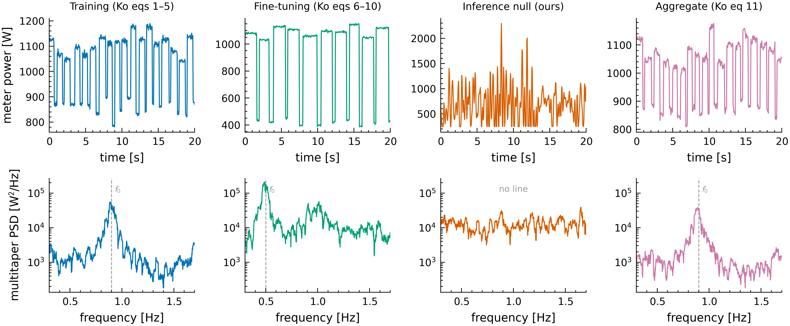
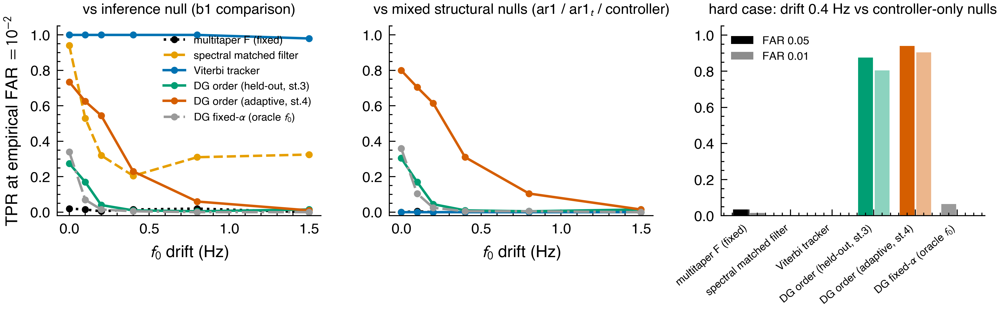
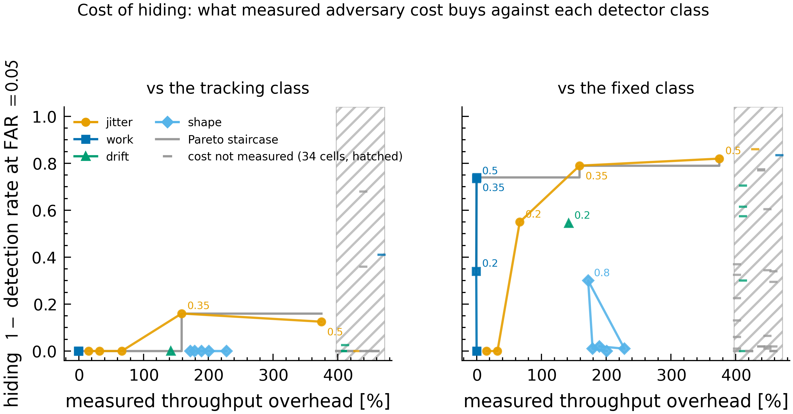
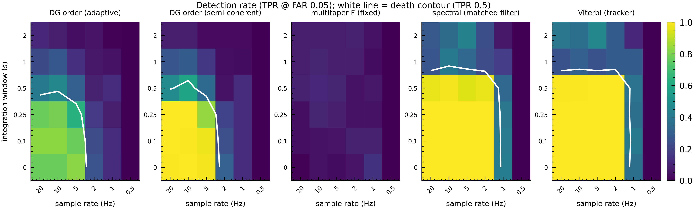
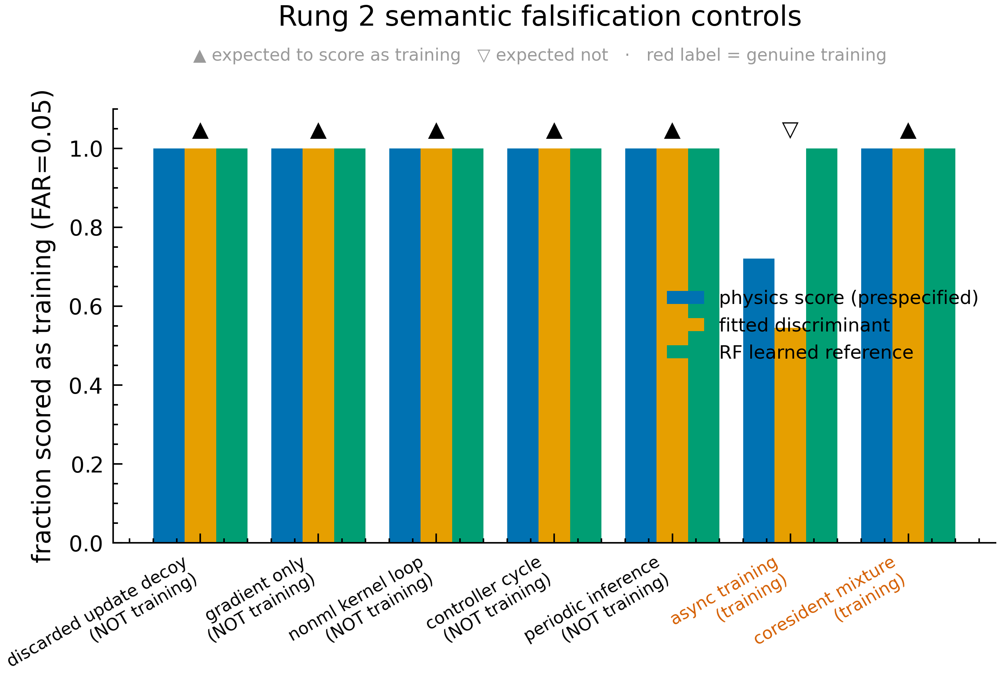
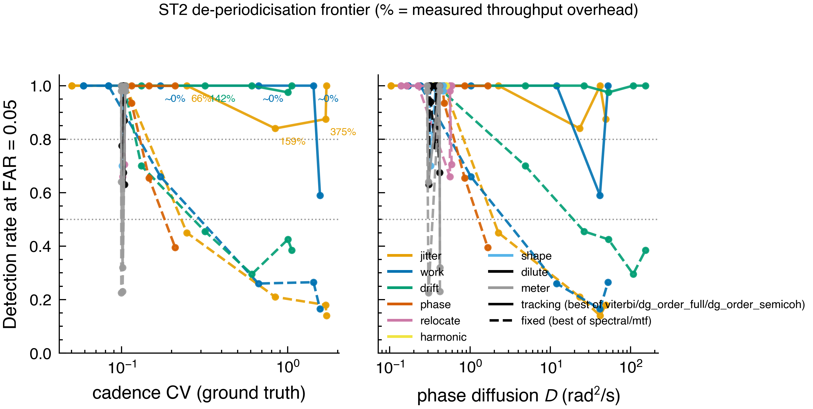
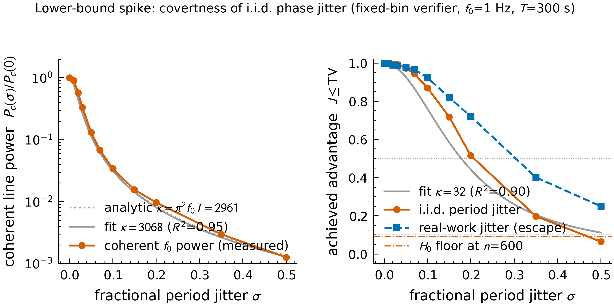
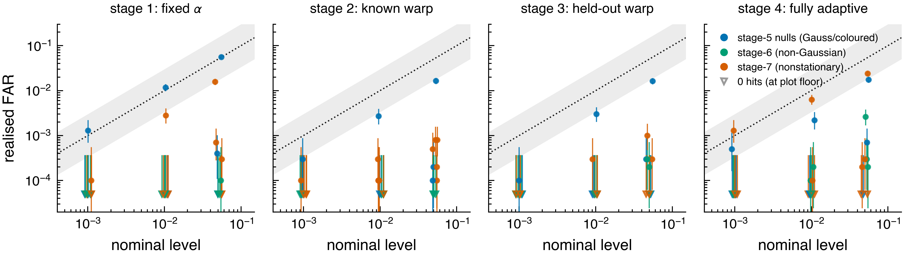
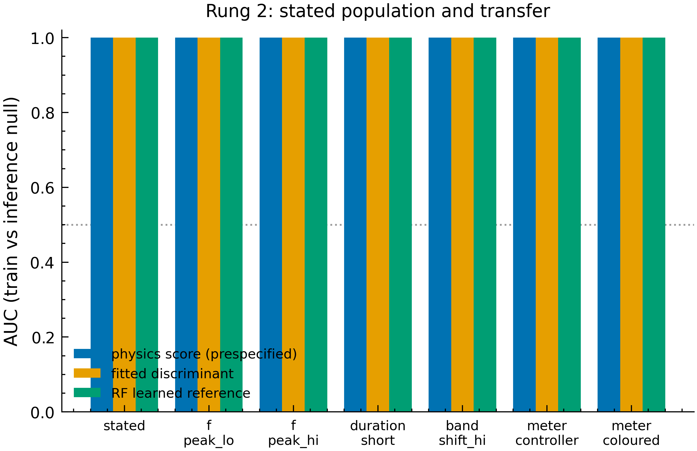

<!-- _class: title -->

# What a passive power meter can certify about AI training

## A claim ladder for adversarial verification

Tom Kimpson · Mauricio Baker · Emlyn Graham · Anjay Friedman · Coby Joseph

<!--
Opening (20 seconds): Start with the governance question, not the detector. The talk is
about the limits of inference from one externally measured physical channel.
-->

---

The policy question

# A regulator sees one scalar trace

  

    
?

    <strong>Inside the facility</strong> 
    Training, inference, control loops, cooling, and unrelated tenants
  

  
→

  

    
y(t)

    <strong>Outside the prover</strong> 
    A time-resolved power trace
  

  
→

  

    
✓?

    <strong>Governance decision</strong> 
    Did a restricted training run occur?
  

<strong>Question:</strong> what conclusions does the trace actually license?

<!--
The attraction is that the meter can sit outside the prover's software and control. But
the verifier is solving an inverse problem: many internal causes have been collapsed to
one signal.
-->

---

# Power is trusted as a channel—not automatically as evidence

  

    <h2>Why it is attractive</h2>
    <ul>
      <li>Measured outside the prover's software stack</li>
      <li>Continuous and comparatively cheap</li>
      <li>Physical work must consume energy</li>
    </ul>
  

  

    <h2>Why it is dangerous</h2>
    <ul>
      <li>Thousands of devices collapse into one number</li>
      <li>The meter filters, integrates, and samples</li>
      <li>Different programs can create the same physical schedule</li>
    </ul>
  

observed trace = workload physics + nuisance loads + meter transfer function

The meter may be trustworthy while the interpretation is not.

---

The physical hypothesis

# Efficient synchronous training should leave a rhythm

  
<strong>Forward</strong>compute

  
→

  
<strong>Backward</strong>compute

  
→

  
<strong>All-reduce</strong>communication barrier

  
→

  
<strong>Update</strong>then repeat

  Repeated compute–communication phases can create a <strong>cadence line</strong> whose frequency wanders as iteration time changes.

The target is not a perfectly fixed frequency. It is order-coherent variation that remains repeatable after following the cadence.

<!--
The physical claim is intentionally narrow. We are not asserting that every training run
has a line. We target efficient, synchronous, iteration-structured training.
-->

---

<!-- _class: figure -->

# The scenario model makes that hypothesis visible

synthetic scenario Literature-parameterized workload and off-chip observation model. Time-domain traces above; spectra below.

<!--
Point out the contrast between the training-like cadence and the inference/null traces.
Do not imply that these plots are measured datacenter traces.
-->

---

The first trap

# A tracker can lock onto a real line—and still track the wrong thing

  

    <h2>Target A</h2>
    
True iteration cadence on one measured A100

    
<strong>≈ 0.4% of board power</strong>

  

  

    <h2>Confounder B</h2>
    
A power-management limit cycle under time-varying load

    
<strong>≈ 10× stronger than A</strong>

  

  

    <h2>Viterbi result</h2>
    
Correctly follows the strongest plausible path

    
<strong>But that path is B</strong>

  

<strong>Tracking solves frequency wander. It does not solve causal attribution.</strong>

<!--
This is the historical failure that motivates the present framing. A fixed frequency bin
was not the only problem. Even a good adaptive tracker can return a clean answer to the
wrong physical question.
-->

---

The deeper trap

# Even the right cadence does not prove training

  

    <h2>Genuine training</h2>
    
forward → gradients → update

    
y(t)

  

  

    <h2>Semantic decoy</h2>
    
forward → gradients → discard

    
y(t)

  

If two behaviours induce the same trace distribution, every passive detector has the same decision distribution.

No better algorithm can recover information that never reaches the meter.

<!--
This is an identifiability statement, not an engineering complaint. The decoy can perform
the same physical operations and omit only the semantically important state transition.
-->

---

The organizing idea

# Every stronger claim must buy more information

  

    
1

Structural evidence

    
information One trace

    
cannot exclude Confounders, shaping, superposition

  

  

    
2

Conditional classification

    
information Trace + stated null population

    
cannot exclude Domain shift, semantic decoys

  

  

    
3

Active authentication

    
information Unpredictable challenge

    
cannot exclude Challenge-aware dummy work

  

  

    
4

Work verification

    
information Challenge + bound transcript

    
cannot exclude Unbound co-located responder

  

<!--
This is the spine of both the talk and the paper. Each rung answers a different question.
The point is not that the lower rungs are useless; it is that their conclusions must not
be silently upgraded.
-->

---

Rung 1 · structural evidence

# Test for order-coherent structure—not for “training”

  
<strong>1 · Trace</strong>remove slow trend and nuisance scale

  
→

  
<strong>2 · Track</strong>follow a candidate wandering cadence

  
→

  
<strong>3 · Dewarp</strong>express time in estimated cycle order

  
→

  
<strong>4 · Test</strong>ask whether the waveform repeats by order

  

    <h2>Evidence for</h2>
    
A repeatable physical schedule whose cadence may drift.

  

  

    <h2>Not evidence for</h2>
    
The semantic identity of the program or a model update.

  

corpus-free calibration A single trace can be compared with Fourier surrogates under a restricted linear-stationary structural null.

---

<!-- _class: figure -->

# Finding a line and attributing structure are different jobs

synthetic bake-off Detection rate at nominal false-alarm rate 0.05. Viterbi dominates against the inference null (left); order-based statistics reject controller-line confusers (middle and right).

<strong>Lesson:</strong> the detector that best follows a wandering line need not be the detector that best distinguishes its cause.

<!--
Read the panels from left to right. The Viterbi score is excellent when the negative has
no competing line. Against structural/controller confusers it is not an attribution test.
The order-domain statistics ask a different, more specific question.
-->

---

# There are two different “null” problems

<table class="matrix">
  <thead>
    <tr><th></th><th>Question</th><th>Where the comparison comes from</th><th>What calibration means</th></tr>
  </thead>
  <tbody>
    <tr>
      <td><strong>Rung 1</strong></td>
      <td>Is this more structured than a linear-stationary trace?</td>
      <td>Fourier surrogates made from the trace itself</td>
      <td>Valid only for that structural null</td>
    </tr>
    <tr>
      <td><strong>Rung 2</strong></td>
      <td>Is this more training-like than stated inference?</td>
      <td>An explicit reference population</td>
      <td>Conditional on that population and transfer</td>
    </tr>
  </tbody>
</table>

  Adaptive search changes the score distribution. Calibration must rerun the <strong>entire</strong> search on every surrogate or null trace.

The surrogate method does not make controller cycles part of the null, and the classifier cannot avoid stating what “non-training” means.

<!--
This addresses the concern that verification requires an inaccessible set of null traces.
Rung 1 can be corpus-free, but only by asking the weaker structural question. Rung 2
genuinely requires a population assumption. Also emphasize that the analytic chi-square
calibration failed after adaptation; rerunning the full pipeline is the honest repair.
-->

---

The adaptive prover

# Robustness is not binary; it is a cost frontier

  

    
How much useful work must the prover give up to make the trace look benign?

    
<strong>Unlimited adversary:</strong> passive semantic verification is impossible.

    
<strong>Operational question:</strong> which evasions are cheap, and which are costly?

  

  

    <h2>Attack families</h2>
    
idle jitter · real-work variation · drift · phase diffusion · harmonic relocation · shaping · dilution · meter degradation

  

50 synthetic cells 16 measured cost anchors The attacker knows the detector family; unpriced cells remain visibly unpriced.

---

<!-- _class: figure figure-tight -->

# The cost frontier is sharply asymmetric

synthetic detection measured throughput anchors Fixed-frequency tests lose 0.74 detection power at ≈0% overhead; the tracking envelope loses only 0.16 at 159% overhead. Hiding = 1 − best detection rate in class, at nominal false-alarm rate 0.05.

<!--
This is the central empirical figure. Explain the asymmetry, then immediately state its
scope: only 16/50 cells are priced, and the class curve is the best score per cell rather
than a deployed joint policy.
-->

---

A qualification that matters operationally

# The frontier is a detector-class envelope—not yet one deployed verifier

<table class="matrix">
  <thead>
    <tr><th>Method</th><th>Follows variable real work</th><th>Rejects controller-line confusers</th><th>Role in current evidence</th></tr>
  </thead>
  <tbody>
    <tr>
      <td><strong>Raw Viterbi score</strong></td>
      <td class="yes">Strong</td>
      <td class="no">Weak</td>
      <td>Robust path finder</td>
    </tr>
    <tr>
      <td><strong>Order-domain tests</strong></td>
      <td class="partial">Degrade earlier</td>
      <td class="yes">Strong</td>
      <td>Structural attribution</td>
    </tr>
  </tbody>
</table>

  We have not yet demonstrated one jointly calibrated decision rule that inherits both strengths across the full frontier.

A real verifier may run every algorithm it wants—but it must calibrate the final combined decision policy, including selection among them.

<!--
This is not the claim that the verifier must choose one algorithm in advance. It can run
many. The missing experiment is a calibrated joint rule—AND, OR, gating, or a learned
combiner—evaluated against both controller confusers and the work-variation frontier.
-->

---

<!-- _class: figure -->

# The meter is part of the theorem

  

<strong>Sample</strong> at least ≈ 2 Hz

  

<strong>Integrate</strong> no longer than ≈ 0.5 s

  

<strong>Avoid</strong> a deep in-band notch

scenario-specific boundary A 1 s boxcar nulls the 1 Hz band centre; a 1 Hz sampler crosses the cadence-band Nyquist edge.

<!--
Do not state these numbers as universal hardware requirements. They are the minimum in the
scenario's 0.3–1.7 Hz cadence band. The transferable point is that observation-channel
specification is logically prior to detector claims.
-->

---

Rung 2 · conditional classification

# Against the stated inference population, the classifiers look perfect

  

    
1.00

    <h2>Physics score AUC</h2>
  

  

    
1.00

    <h2>Fitted linear AUC</h2>
  

  

    
1.00

    <h2>Random forest AUC</h2>
  

The result persists across the tested duration, frequency-band, controller, and coloured-noise shifts.

<strong>But accuracy against a declared null is not the same thing as semantic validity.</strong>

synthetic populations · n = 200 per class

---

<!-- _class: figure figure-tight -->

# The semantic controls overturn the naive conclusion

  

    
Five non-training workloads are called “training” by every rule.

    <ul class="small">
      <li>discarded update</li>
      <li>gradient only</li>
      <li>non-ML kernel loop</li>
      <li>controller cycle</li>
      <li>periodic inference</li>
    </ul>
    
<strong>The meter certifies a physical schedule, not training semantics.</strong>

  

  

    
  

synthetic falsification controls Fraction classified as training at false-positive rate 0.05 on the stated null.

<!--
This is the payoff of the ladder. The classifiers are not broken: they correctly detect
the physics they were given. The problem is silently relabelling physical likeness as
semantic identity.
-->

---

Rungs 3 and 4

# Stronger claims require changing the protocol

  
<strong>Unpredictable challenge</strong>Verifier changes timing or workload conditions

  
→

  
<strong>Physical response</strong>Power changes at the right time and shape

  
→

  
<strong>Bound transcript</strong>Response commits to fresh state transitions

  
→

  
<strong>Stronger claim</strong>Authenticated physical work

  

    <h2>Rung 3 says</h2>
    
Something at the meter answered my fresh challenge.

  

  

    <h2>Rung 4 still needs</h2>
    
Cryptographic or systems binding between that response and the claimed model update.

  

protocol specified, not run A co-located dummy responder remains the key gap without binding.

---

Reality check

# The one measured transport case fails the naive story

  

    
0.4%

    
iteration-cadence modulation of ≈370 W board power

  

  

    
10×

    
stronger power-controller line in the relevant band

  

  

    
75×

    
gap from the scenario model's modulation depth

  

  Every positive result in this talk is synthetic or literature-parameterized. The A100 trace is a <strong>negative transport case</strong>, not validation.

Falsifiable next step: synchronized multi-GPU communication should deepen and cohere the cadence at an external rack or wall meter.

---

# What the present work establishes—and what remains open

  

    <h2>Established in scope</h2>
    <ul class="small">
      <li>A claim ladder with explicit information costs and ceilings</li>
      <li>Corpus-free calibration for a restricted structural null</li>
      <li>A synthetic de-periodicisation frontier with measured cost anchors</li>
      <li>A scenario-specific minimum meter boundary</li>
      <li>A constructive semantic impossibility result</li>
    </ul>
  

  

    <h2>Not yet established</h2>
    <ul class="small">
      <li>External-meter detection on a real synchronized cluster</li>
      <li>A joint rule robust to both controller confusers and variable work</li>
      <li>The learning-efficiency cost where the tracker finally fails</li>
      <li>Passive proof that model state was updated</li>
      <li>An implemented active challenge and binding protocol</li>
    </ul>
  

<strong>This is a theory-and-methods result:</strong> a map of defensible claims, useful tests, attack costs, and hard limits.

<!--
This slide is the contract with the audience. It also defines the paper revision: keep
the ladder and frontier central, and make the joint-rule gap and real cluster validation
explicit priorities rather than burying them.
-->

---

<!-- _class: takeaway -->

# Three things to remember

  
1

  
Passive power can provide calibrated evidence about a <strong>physical schedule</strong>.

  
2

  
Against an adversary, the meaningful result is a <strong>detection–utility frontier</strong>, not “robust” or “not robust.”

  
3

  
Claims about <strong>training semantics</strong> require extra information: a stated null, an active challenge, and ultimately binding to state transitions.

The meter is useful precisely when we are exact about what it cannot say.

---

<!-- _class: appendix -->

# The paper spine implied by the talk

  
<strong>1 · Identifiability</strong>What can a scalar trace possibly distinguish?

  
→

  
<strong>2 · Claim ladder</strong>What extra information buys each stronger claim?

  
→

  
<strong>3 · Frontier</strong>How cheaply can an adaptive prover hide?

  
→

  
<strong>4 · Ceilings</strong>What remains impossible or unvalidated?

Detector construction supports the story; it should not become the story.

  

<strong>Method role</strong> Operationalize the weakest claim.

  

<strong>Empirical role</strong> Price adaptive evasion.

  

<strong>Control role</strong> Falsify semantic overclaiming.

---

<!-- _class: appendix figure -->

# Full de-periodicisation frontier

Cadence variation and phase diffusion versus detector power across all attack families. Solid: best tracking-class score per cell. Dashed: best fixed-class score per cell.

---

<!-- _class: appendix figure -->

# A limited lower-bound direction

<strong>If an exhibited test still has advantage J, then the attacked and benign trace distributions are at least J apart in total variation.</strong>

The converse does not follow: failure of our detector is not proof of covertness. The cost bridge shown here is specific to i.i.d. timing jitter and a fixed-bin verifier.

---

<!-- _class: appendix figure -->

# Why analytic calibration was rejected

The adaptive pipeline does not preserve the simple analytic reference law. Per-trace surrogates rerun the complete search; empirical false-alarm control is reported only over the tested structural null family.

---

<!-- _class: appendix figure -->

# Rung 2 transfer tests

All three rules separate the scenario training population from the stated inference population across the tested shifts. This is conditional discrimination, not semantic identification.

---

<!-- _class: appendix -->

# Evidence map

<table class="matrix">
  <thead>
    <tr><th>Claim</th><th>Evidence used here</th><th>Main missing validation</th></tr>
  </thead>
  <tbody>
    <tr><td><strong>Structural detector</strong></td><td>Synthetic bake-off + surrogate calibration</td><td>External aggregate traces</td></tr>
    <tr><td><strong>Adversarial frontier</strong></td><td>Synthetic attacks + 16 measured cost anchors</td><td>Prices for 34 cells; learning cost</td></tr>
    <tr><td><strong>Meter boundary</strong></td><td>Scenario observation sweep</td><td>Real meter transfer functions</td></tr>
    <tr><td><strong>Conditional classifier</strong></td><td>Synthetic stated null + transfer shifts</td><td>Representative deployment null</td></tr>
    <tr><td><strong>Semantic ceiling</strong></td><td>Constructive decoys + identifiability argument</td><td>Cannot be repaired passively</td></tr>
    <tr><td><strong>Active verification</strong></td><td>Protocol specification</td><td>Implementation and binding</td></tr>
  </tbody>
</table>
